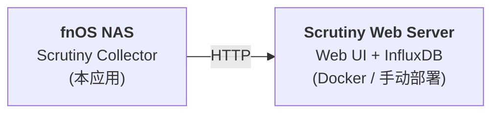

# Scrutiny Collector for fnOS

硬盘 S.M.A.R.T 健康监控采集器，定时采集硬盘健康数据并发送到 [Scrutiny](https://github.com/Starosdev/scrutiny) Web 服务进行可视化监控。

## 功能

- 定时采集本机所有硬盘的 S.M.A.R.T 健康数据
- 支持 HDD、SSD、NVMe 等各种存储设备
- 数据发送到远程 Scrutiny Web 服务进行可视化展示
- 可配置采集频率（15 分钟 ~ 24 小时）
- 可自定义 Host ID，多台 NAS 在同一面板中区分
- 原生运行，无需 Docker
- 支持 x86 和 arm 双架构
- 自动跟踪上游版本发布

## 架构说明

本应用仅包含 **Collector 采集端**，需要配合 Scrutiny Web 服务使用：



Scrutiny Web 服务可以部署在同一台 NAS（Docker）或其他服务器上，参考 [Scrutiny 官方文档](https://github.com/Starosdev/scrutiny)。

## 前置要求

- fnOS 0.9.0+
- 系统已安装 `smartmontools`（含 `smartctl` v7+）
- 需要一个运行中的 [Scrutiny Web 服务](https://github.com/Starosdev/scrutiny) 来接收数据

## 安装

### 方式一：从 FPK 安装

1. 从 [Releases](../../releases) 下载对应架构的 `.fpk` 文件
   - `*_x86.fpk` — Intel/AMD 平台
   - `*_arm.fpk` — ARM 平台
2. 在 fnOS 应用中心 → 手动安装 → 选择 `.fpk` 文件
3. 安装向导中配置 Scrutiny API 地址、Host ID 和采集间隔

### 方式二：本地构建

```bash
# 构建双架构
./build.sh all

# 仅构建 x86
./build.sh amd64

# 仅构建 arm
./build.sh arm64

# 清理构建产物和缓存
./build.sh clean
```

构建产物位于项目根目录：`starosdev.scrutiny.collector_<version>_<platform>.fpk`

## 配置参数

安装时通过向导配置，安装后可通过 fnOS 应用中心的「配置」功能修改：

| 参数 | 说明 | 默认值 |
|------|------|--------|
| Scrutiny API 地址 | Scrutiny Web 服务的 API 端点 | `http://localhost:8080` |
| Host ID | 当前设备标识名，用于在 Scrutiny 面板区分多台主机 | `fnOS` |
| 采集间隔 | S.M.A.R.T 数据采集频率（15min / 30min / 1h / 6h / 12h / 24h） | 每 15 分钟 |

## 工作原理

通过 cron 定时任务调用 `scrutiny-collector-metrics` 二进制文件：

1. **启动** → 检查环境（jq、smartctl、collector 二进制）→ 创建 cron 定时任务 → 立即执行一次采集
2. **运行** → cron 定时调用 `smartctl` 采集所有硬盘 S.M.A.R.T 数据，发送到 Scrutiny API
3. **停止** → 移除 cron 定时任务 → 终止正在运行的采集进程
4. **配置** → 更新配置文件 → 自动重建 cron 任务（无需手动重启）

配置文件存储在 `var/settings.json`，日志文件为 `var/info.log`（超过 1MB 自动轮转）。

## 自动更新

项目配置了 GitHub Actions 自动跟踪上游 Scrutiny 版本：

- 每天自动检查 [Scrutiny 上游仓库](https://github.com/Starosdev/scrutiny) 是否有新版本发布
- 检测到新版本后自动创建 tag 并触发双架构构建和 Release 发布
- 也可手动触发 Release workflow 指定版本号构建

## 项目结构

```
├── cmd/                     # 生命周期脚本
│   ├── _functions           # 共享函数库（jq 检查、cron 转换、URL 校验、日志轮转）
│   ├── main                 # 启停和状态检查
│   ├── install_callback     # 安装后：读取向导输入，生成 settings.json
│   ├── config_callback      # 配置后：更新配置，重建 cron 任务
│   ├── upgrade_callback     # 更新后：权限设置，配置迁移
│   ├── uninstall_callback   # 卸载后：清理 cron，按用户选择保留/删除数据
│   └── ...                  # 其他生命周期脚本
├── config/
│   ├── privilege            # 权限声明（root，因 smartctl 需要）
│   └── resource             # 资源声明
├── wizard/
│   ├── install              # 安装向导（API 地址、Host ID、采集间隔）
│   ├── config               # 配置向导
│   └── uninstall            # 卸载向导（数据保留选项）
├── .github/
│   ├── workflows/
│   │   ├── release.yml      # 构建和发布 FPK
│   │   └── check-upstream.yml  # 自动跟踪上游版本
│   └── actions/             # 可复用的 GitHub Actions
│       ├── setup-fnpack/    # 安装 fnpack 工具
│       ├── build-fpk/       # 构建 FPK 包
│       └── release-fpk/     # 创建 GitHub Release
├── build.sh                 # 本地多架构打包脚本
├── manifest                 # 应用元信息
├── ICON.PNG                 # 应用图标 64x64
├── ICON_256.PNG             # 应用图标 256x256
└── README.md
```

## 常见问题

### Collector 启动后无数据

1. 检查 Scrutiny Web 服务是否正常运行且网络可达
2. 查看日志确认采集是否成功：

```bash
cat /var/apps/starosdev.scrutiny.collector/var/info.log
```

3. 确认 API 地址配置正确（应为 Scrutiny Web 服务地址，如 `http://192.168.1.100:8080`）

### 修改配置后不生效

通过 fnOS 应用中心的「配置」功能修改参数后，如果应用正在运行，cron 任务会自动更新，无需手动重启。

## 许可

基于 [Scrutiny](https://github.com/Starosdev/scrutiny) 项目，遵循 MIT License。
